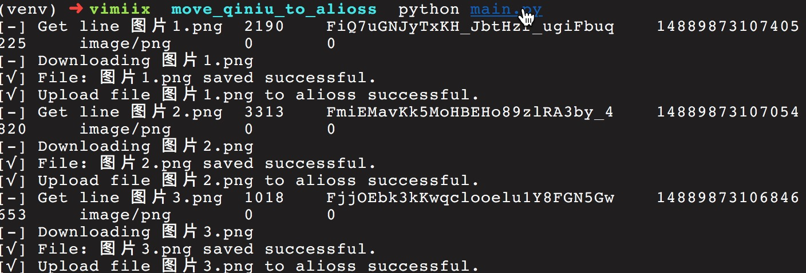

# move_qiniuyun_to_alioss

## 特性：

- 个性化配置
- 本地/阿里云双备份
- 自动化完成备份，上传

## 准备工作

使用 `tool/` 目录中的七牛云工具 `qshell-darwin-x64`，拉一份要搬移的七牛云 bucket 的文件清单：

```bash
# 分别是 执行程序 命令行 bucket_name 生成的文件名
./tool/qshell-darwin-x64 listbucket2 vimiix-blog-data listbucket.txt
```

执行完以后正常会在当前目录生成一个 `listbucket.txt` 的文件，准备工作就做好了。

## 修改配置文件

根据 `config` 文件中的注释将每个参数设置为自己对应的值即可。

- AliOss AccessKeyID 和 AccessKeySecret 获取地址
    - https://usercenter.console.aliyun.com/#/manage/ak

## 执行

这个工具使用到了阿里云的 oss2 包，需要 版本大于3， 但看官网写着最高支持到Python3.5

所以我的虚拟环境也使用的Python3.5，建议你也这么做，省的麻烦。

```bash
virtualenv --python=python3.5 venv --no-site-package

source venv/bin/activate

pip install -r pip-req.txt

python main.py
```

## 执行结果



## License

Apache 2.0
